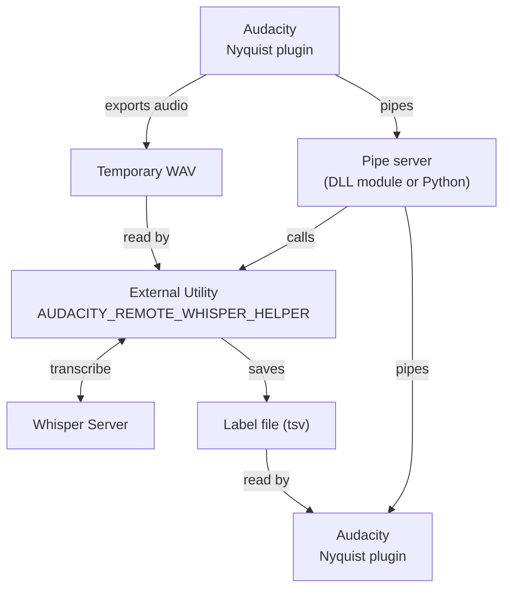

# Remote Whisper Speech-to-Text for Audacity

This repository provides an Audacity plugin and a companion Windows pipe server that send audio to an external Whisper-compatible speech-to-text (STT) service and create a label track with word-level timing.

### Installation

1. **Build the helper executable:**

   ```bash
   # Windows (using vcpkg for CURL)
   cmake -S . -B build -DCMAKE_TOOLCHAIN_FILE=path/to/vcpkg/scripts/buildsystems/vcpkg.cmake
   cmake --build build --config Release
   ```
   No build required for Linux/MacOS, use the appropriate Python's pipeserver instead windows module DLL.

2. **Locate these files:**
   - `remote-whisper-stt.ny` (Nyquist plugin in the project root)
   - `remote_whisper_pipe_server.py` (Python's pipe server in the project root)
   - `build/Release/whisper-helper.exe` for Windows
   - `build/Release/pipeserver-mod.dll` for Windows

3. **Copy `remote-whisper-stt.ny` to Audacity's plug-ins folder:**
   - **Windows**: `C:\Users\<YourName>\AppData\Roaming\Audacity\Plug-Ins\`
   - **macOS**: `~/Library/Application Support/audacity/Plug-Ins/`
   - **Linux**: `~/.audacity-data/Plug-Ins/`

4. **For Windows, copy `pipeserver-mod.dll` into Audacity's `modules` directory.***
    
      Then start Audacity and switch `Enabled` against **pipeserver-mod** module in **Preferences->Modules**. Close Audacity afterwards.

4. Export `AUDACITY_REMOTE_WHISPER_HELPER` environment variable with a full path to an executable (whisper-helper.exe for Windows, a whisper helper script for Linux/MacOS)

4. **For Linux/MacOS: Install pipeserver and dependencies:** place `remote_whisper_pipe_server_macos.py` into a direcory and create a virtual environment. 

   - 4.1 **Install Python's dependencies**:

      ```pip install -r requirements_macos.txt```

5. **Restart Audacity**

### Usage

1. If you are on Linux or MacOS, launch the Python's pipe server from the directory that contains both the Python script and `whisper-helper.exe`:

   ```bat
   py -3 remote_whisper_pipe_server.py
   ```

   Leave this window running while you use Audacity.

2. Select the audio you want to transcribe (or select nothing to transcribe the entire project)
3. Go to **Analyze → Remote Whisper Transcription...**
4. In the dialog:
   - **Server URL**: Enter your Whisper STT server URL (e.g., `http://ai1:443/v1/files`)
   - **Language Code**: Enter the language code (e.g., `en` for English)
5. Click **OK**
6. The plugin exports the audio, waits for the server response, and then creates a label track if the filenames match.

### How It Works




## Expected STT API

The helper expects an HTTP POST endpoint that accepts raw WAV audio with `filename` and `language` query parameters:

**Request:**
```bash
curl -X POST "http://ai1:443/v1/files?filename=sample.wav&language=en" \
  -H "Content-Type: audio/wav" \
  --data-binary '@audio.wav'
```

**Response (JSON):**
```json
{
  "result": [
    {
      "transcript": "Hello world",
      "words": [
        { "start": 0.0, "end": 0.5, "text": "Hello" },
        { "start": 0.5, "end": 1.0, "text": "world" }
      ]
    }
  ]
}
```

## Building

### Prerequisites

- CMake 3.15 or newer
- C++ compiler (Visual Studio 2022 on Windows, GCC/Clang on Linux/Mac)
- CURL library (install via vcpkg or system package manager)
- nlohmann/json library (install via vcpkg or system package manager)
- wxWidgets library (install via vcpkg or system package manager)

### Windows (Visual Studio 2022)

Using vcpkg for dependencies:

```bat
# Install dependencies via vcpkg
vcpkg install curl:x64-windows-static nlohmann-json:x64-windows wxWidgets:x64-windows-static

# Configure
cmake -S . -B build -G "Visual Studio 17 2022" -A x64 ^
  -DCMAKE_TOOLCHAIN_FILE=C:/path/to/vcpkg/scripts/buildsystems/vcpkg.cmake

# Build
cmake --build build --config Release

# Files will be in:
# - build/Release/whisper-helper.exe
# - build/Release/pipeserver-mod.dll
```

## Troubleshooting

The pipeserver-mod.dll writes logs in the temporary folder under `remote-whisper.log`

The Python's pipeserver writes displays logs in the console.

## License

MIT License - see project files for details.

## Contributing

Issues and pull requests welcome!
